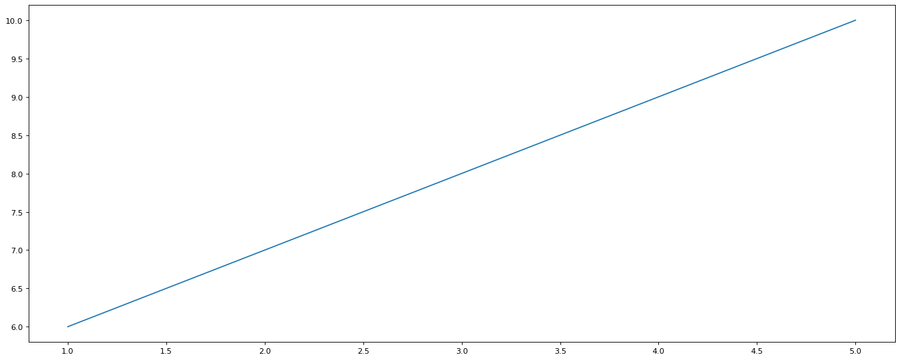
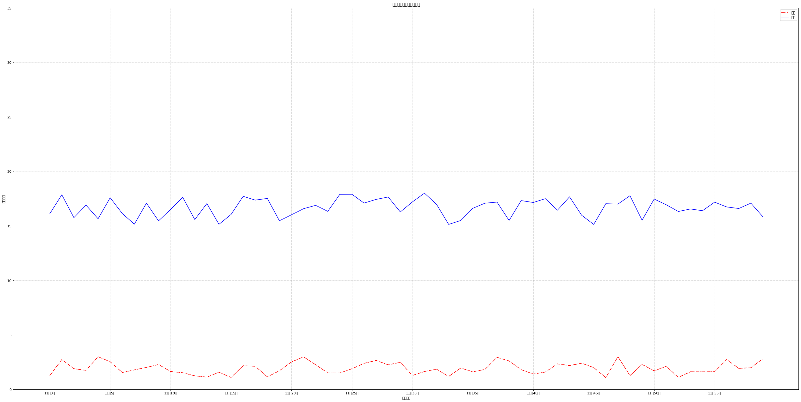

# Matplotilb

### 一、介绍

Matplotilb是专门用于开发2D图表的python库

### 2.1、三层结构

#### 一、容器层

- 1.画板层Canvas
- 2.画布层Figure
- 3.绘图层/坐标系

#### 二、辅助显示层

#### 三、图像层

## 二、折现图（plot）与基本绘图功能

### 基本步骤
- 1.创建画布
- 2.绘制图像
- 3.显示图像


```python
# 相应的包
import matplotlib.pyplot as plt

# 1.创建画布（函数plt.figure()）
plt.figure(figsize=(20,8),dpi=80)
    ### figsize:画布大小
    ### dpi ： 清晰度
    
# 2.绘制图像
plt.plot([1,2,3,4,5],[6,7,8,9,10])

# 保存图像（保存图像代码应位于plt.show()之前）
# plt.savefig("存放路径/名称")

# 3.显示图像
plt.show()
```


    

    


### 辅助显示层


```python
import random
# 1、准备数据 X Y
x = range(60)
y_hefei = [random.uniform(15,18)for i in x]
y_huainan = [random.uniform(1,3)for i in x]


# 画图步骤
# 2、创建画布
plt.figure(figsize=(40,20),dpi=80)

# 3、绘制图像
plt.plot(x,y_huainan,color='r', linestyle='-.',label='上海')
plt.plot(x,y_hefei,color='b',label='合肥')

# 添加了Label标签需显示图例plt.legend()
plt.legend() #放参数可以控制图例位置（可数字）

# 修改x,y刻度
# 准备x的刻度说明 
x_label = ['11点{}分'.format(i) for i in x]
# 添加x刻度
plt.xticks(x[::5],x_label[::5])
# 添加y刻度
plt.yticks(range(0,40,5))

# 添加网格显示，其中alpha是网格的透明程度,linestyle显示线格样式
plt.grid(linestyle='--',alpha=0.5)

#添加描述
plt.xlabel("时间变化")
plt.ylabel("温度变化")
plt.title("合肥、淮南温度变化状况")

# 4、显示图片
plt.show()
```


    

    


```python

```
