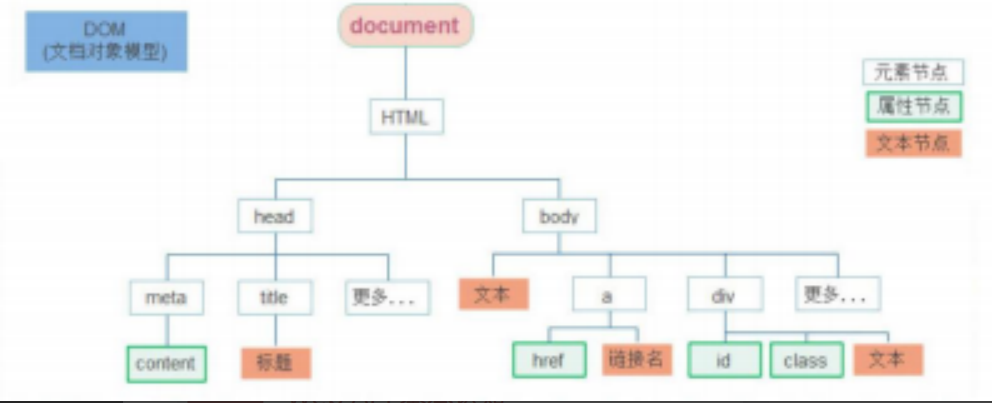
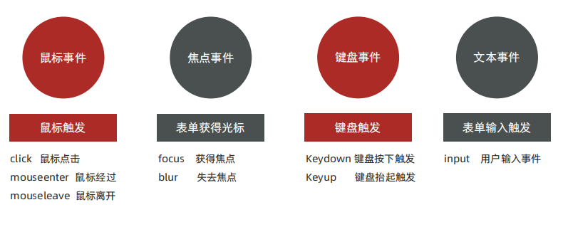
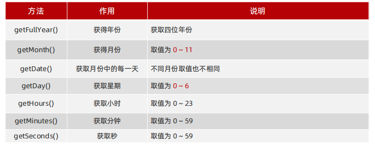

# Web APIs
## 第一天
### 01、Web API 基本认知
- 作用和分类
    - 作用：就是用js去操作html和浏览器
    - 分类：DOM(文档对象模型)、BOM(浏览器对象模型)
- 什么是DOM
    - DOM——<font style="color:red">文档对象模型</font>是用来呈现以及与任意HTML或XML文档交互的API
    - 白话文:DOM是浏览器提供的一套专门用来操作网页内容功能
- DOM树
    - 作用:DOM树直观的体现了标签与标签之间的关系

- DOM对象(重要)
    - DOM对象:浏览器根据html标签生成的js对象
        - 所有标签属性都可以在这个对象上面找到
        - 修改这个对象的属性会自动映射到标签身上
    - DOM的核心思想
        - 把网页内容当作对象来处理
    - document对象
        - 是DOM里提供的一个对象
        - 所以它提供的属性和方法都是用来访问和操作网页内容的
        - 网页所有内容偶在document里面
### 02、获取DOM元素
- 根据CSS选择器来获取DOM元素
```js
   document.querySelector('css选择器')  //匹配第一个元素    
   document.querySelectorAll('css选择器') //返回集合全部元素
```
- 其他获取DOM元素方法
```js
    document.getElementById('nav')
    document.getElementByTagName('div')
    document.getElementByclassName('w')
```
### 03、定时器-间歇函数
- 1.开启定时器
    - 语法
    ```js
    setInterval(函数,间隔时间)
    ```
    - 作用：每隔一段时间调用这个函数
    - 间隔时间单位是毫秒
- 2.关闭定时器
    - 语法
    ```js
    let 变量名 = setInterval(函数,间隔时间)
    clearInterVal(变量名)
    ```
## 第二天
### 1、事件
- 什么是事件？
    例如单机按钮
- 什么是事件监听
    就是让程序检测是否有事件产生
- 语法
```js
    元素.addEventListener('事件',要执行的函数)
```
- 事件监听三要素
    - 事件源
    - 事件
    - 事件调用函数
- 事件监听
    - 例子
    ```js
    <!-- 获取元素 -->
    let btn = document.querySelector('button')
    <!-- 事件监听 -->
    btn.adddEventListener('click',function(){
        alert('被点击了')
    })
    ```
    
### 02、高阶函数
- 函数表达式
    - 函数表达式和普通函数并无本质上的区别
    - <font style="color:red">    函数表达式必须要先声明再调用</font>
    - 语法：
    ```js
    let counter = function(x,y){
        retrun x+y
    }
    <!-- 调用函数 -->
    let result = counter(5,10)
    console.log(result)
    ```
- 回调函数
如果将函数 A 做为参数传递给函数 B 时，我们称函数 A 为回调函数
简单理解： 当一个函数当做参数来传递给另外一个函数的时候，这个函数就是回调函数
### 03、环境变量
> 环境对象指的是函数内部特殊的<font style="color:red">变量 this</font> ，它代表着当前函数运行时所处的环境
作用：弄清this的指向让代码更简洁
- 函数的调用方式不同，this 指代的对象也不同
- 【谁调用， this 就是谁】 是判断 this 指向的粗略规则
- 直接调用函数，其实相当于是 window.函数，所以 this 指代 window

## 第三天
### 01、节点操作
#### DOM节点
- DOM节点：DOM树里每一个内容都称之为节点
- 节点类型
    - 元素节点
        - 所有标签
        - html是根节点
    - 属性节点
        - 所有属性
    - 文本节点
        - 所有文本
    - 其他
- 查找节点
    - 父节点查找：
    ```js
    <!-- 返回最近一级的父节点 找不到返回为null -->
    子元素.parentNode
    ```
    - 子节点查找
    ```js
    <!-- 仅获得所有元素节点/返回的还是一个伪数组 -->
    父元素.children
    ```
- 增加节点
    - 创建节点
    ```js
    <!-- 创造一个新的元素节点 -->
    document.createElement('标签名')
    <!-- 插入到父元素的最后 -->
    父元素.appendChild(要插入的元素)
    <!-- 插入到父元素的某个元素的前面 -->
    父元素.inserBefore(要插入的元素,在那个元素前面)
    ```
    - 删除节点
        - 语法
        ```js
        <!-- 在 JavaScript 原生DOM操作中，要删除元素必须通过父元素删除 -->
        父元素.removeChild(要删除的元素)
        ```
### 02、时间对象
- 实例化
    - 语法
    ```js
    <!-- 获取当前时间 -->
    let date = new Date()
    <!-- 获取指定时间 -->
    let date = new Date('1949-10-01') 
    ```

- 时间戳
> 是指1970年01月01日00时00分00秒起至现在的毫秒数，它是一种特殊的计量时间的方式
- 语法
```js
    let date = new Date()
    // 获取时间戳
    console.log(date.getTime())
```
    
